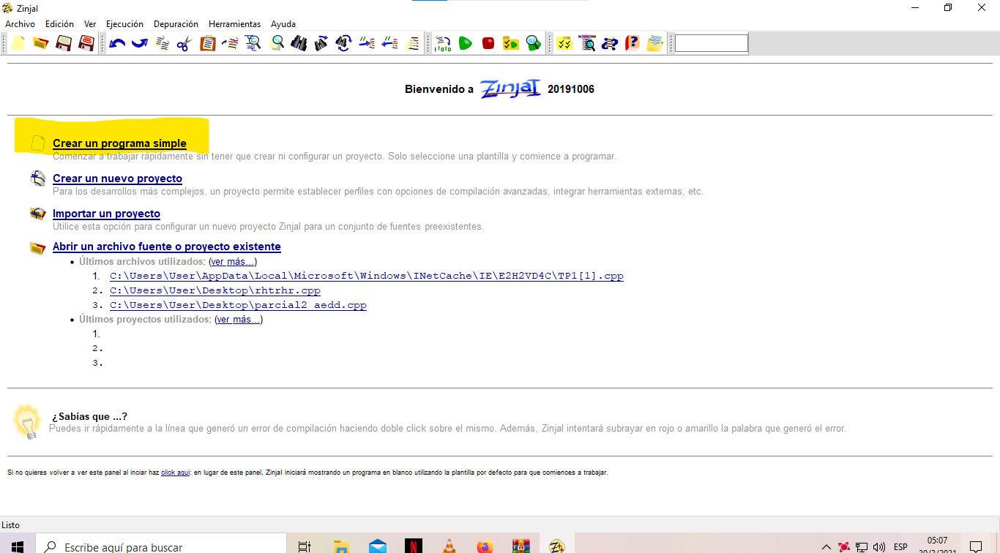
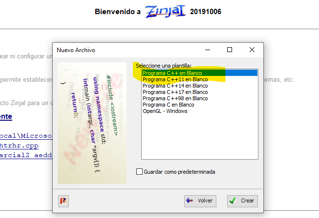
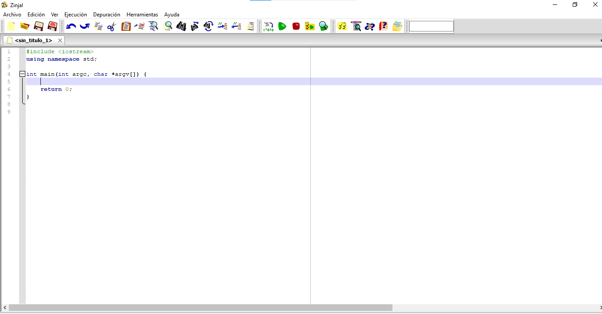

> El IDE utilizado en la materia es zinjal es bastante intuitivo y pueden obtenerlo desde este repositorior
[Zinjal 🗃️](https://zinjai.sourceforge.net/)    

El desarrollador del entorno ha mantenido un registro con las actualizaciones y mejoras desde que inicio el proyecto casi. Pueden ir a leer muchos de sus interesantes posteos en [🪳 Cucarachas racing 🪳](https://cucarachasracing.blogspot.com/)

---
Las carpetas estan pensadas para separar el tipo de ejercicios resueltos y en base a las guias. 
Cree un pequeño tablero de trabajo para seguir el estatus y el de otras materias si quieren echar un vistazo [Trello](https://trello.com/b/mFXNWtP4/algoritmos)

>Este proyecto contiene codigos que resuelven las guias basicas de la materia y variantes. Tambien acceso a las diapositivas de Teoria.
 Variantes y mejoras de cada metodo de ordenamiento de menor a mayor o de mayor a menor.

 Algunos screens y articulos de detalles interesantes al tratar con c++ o relacionado a la inclusion de bases de datos que junte durante el trayecto.
  
Librerias

1. https://en.cppreference.com/w/c.html
2. https://cplusplus.com/reference/

